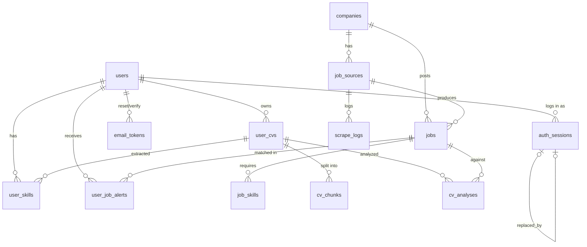

# Database

PostgreSQL 15, async SQLAlchemy 2.x (asyncpg). Models in [`app/models/`](../app/models/); every model composes `UUIDMixin` (UUID v4 PK) + `TimestampMixin` (`created_at`, `updated_at`) from [`base.py`](../app/models/base.py).

## ERD



## Tables

### Identity, auth & profile

| Table | Model file | Key fields |
|---|---|---|
| `users` | [user.py](../app/models/user.py) | `email` (unique), `password_hash`, `full_name`, `phone`, `fcm_token`, `email_verified`, `is_active`, `is_admin`, `preferences` **JSONB** (roles, company watchlist, locations, push/email flags), `last_seen_at` |
| `auth_sessions` | [auth_session.py](../app/models/auth_session.py) | One row **per refresh token**. `family_id` (indexed — groups a login session; equals the first row's `id`), `user_id` FK CASCADE, **`token_hash`** (sha256 of the raw JWT, unique — raw tokens never stored), `client` (web/mobile), `device`/`browser`/`ip_address` (sessions UI), `last_used_at`, `expires_at` (indexed), `revoked_at`, **`replaced_by`** self-FK (rotation chain). Purged daily 1 d after expiry |
| `email_tokens` | [email_token.py](../app/models/email_token.py) | Single-use emailed tokens: `user_id` FK CASCADE, `purpose` (`password_reset`/`email_verify`), `token_hash` (sha256, unique), `expires_at`, `used_at`. Purged daily |
| `user_skills` | [user_skill.py](../app/models/user_skill.py) | `user_id` FK, `cv_id` FK (nullable — manual skills have none), `skill_name` (indexed), `skill_category`, `proficiency_level`, `years_experience`, `confidence_score`, `source`. **`UniqueConstraint("user_id","skill_name")` = `uq_user_skill`** |

### Jobs & scraping

| Table | Model file | Key fields |
|---|---|---|
| `companies` | [company.py](../app/models/company.py) | `name`, `slug` (unique), `careers_url`, `logo_url`, `is_active` |
| `job_sources` | [job_source.py](../app/models/job_source.py) | `company_id` FK, `source_type`, `url`, **`scraper_class`** (registry key), `scrape_interval_minutes`, `is_active`, `last_scraped_at`, `last_success_at`, `health_status`, `consecutive_failures`, `config` JSONB. Methods `mark_success()`/`mark_failure()` |
| `jobs` | [job.py](../app/models/job.py) | `source_id` FK, `company_id` FK, **`external_id`** (dedup key with source), `title`, `description`, `location`, `location_type`, `job_type`, `seniority_level`, `apply_url`, `salary_min/max/currency`, `posted_at`, `discovered_at`, `expires_at`, `is_active`, `raw_data` JSONB, **`validation_status`** (indexed: unverified/valid/suspect/dead — see [scraping.md](scraping.md#validation)), `last_validated_at`, `validation_detail` JSONB, `duplicate_of_job_id` self-FK (cross-source dup link) |
| `job_skills` | [job_skill.py](../app/models/job_skill.py) | `job_id` FK, `skill_name` (indexed), `skill_category`, `is_required`, `min_years_experience`. Populated at ingest by `scrape_service._extract_job_skills` (shared taxonomy); powers recommendations + skill-gap. `uq_job_skill` (job_id, skill_name) |
| `scrape_logs` | [scrape_log.py](../app/models/scrape_log.py) | `source_id` FK, `status`, `jobs_found`, `new_jobs`, `updated_jobs`, `duration_ms`, `error_message`, `error_traceback`, `extra_data` JSONB. Purged after 30 days by Beat |
| `user_job_alerts` | [user_job_alert.py](../app/models/user_job_alert.py) | `user_id` FK, `job_id` FK, `notified_at`, `notification_channel`, `is_delivered`, `is_read`, `is_saved`, `is_applied`, `applied_at`. One row per user↔job match |

### CV & AI

| Table | Model file | Key fields |
|---|---|---|
| `user_cvs` | [user_cv.py](../app/models/user_cv.py) | `user_id` FK, `filename`, `s3_key`, `file_hash` (sha256, indexed for dedup), `file_size_bytes`, **`upload_status`** (state machine below), `is_active`, `processed_at`, `full_text` (extracted text cache), `file_path` (legacy local-disk field). Composite index `(user_id, is_active)` |
| `cv_chunks` | [cv_chunk.py](../app/models/cv_chunk.py) | `cv_id` FK (CASCADE), `user_id` FK, `chunk_index`, `chunk_text`, **`embedding` JSONB** (768-d Gemini vector, nullable when no API key), `section_label` |
| `cv_analyses` | [cv_analysis.py](../app/models/cv_analysis.py) | `cv_id` FK (CASCADE), `job_id` FK, `user_id` FK, `match_score` float, `present_keywords`/`missing_keywords`/`suggested_additions` JSONB, `jd_keywords_snapshot` JSONB, `analyzed_at`, **`expires_at`** (24 h TTL; expired rows purged nightly) |
| `cv_drafts` | [cv_draft.py](../app/models/cv_draft.py) | `cv_id` FK (CASCADE), `job_id` FK, `user_id` FK (CASCADE), `content` JSONB (`{original, tailored, keywords_injected}`), **`status`** (`generating → review → approved → rendered \| failed \| superseded`, indexed), `error`, `docx_s3_key`/`pdf_s3_key`, `approved_at`. One live draft per (cv, job) — new curates supersede |

### CV status machine

```
pending_upload ──(S3 upload + confirm)──▶ uploaded ──(worker picks up)──▶ processing ──▶ ready
                                                                              └────────▶ failed
```

Constants defined in [user_cv.py](../app/models/user_cv.py). Only `ready` CVs can be analyzed/tailored.

## Migrations

Alembic config: [`alembic.ini`](../alembic.ini), env: [`alembic/env.py`](../alembic/env.py), versions: [`alembic/versions/`](../alembic/versions/).

| Revision | File | Contents |
|---|---|---|
| `001_cv_upload_s3` | `001_add_cv_upload_status_s3_key.py` | `user_cvs.upload_status` (indexed) + `s3_key`; `file_hash` index; `(user_id, is_active)` composite index |
| `002_ai_ats_layer` | `002_add_ai_ats_layer.py` | Creates `cv_chunks` + `cv_analyses`; adds `user_cvs.full_text`; `user_skills.cv_id` index |
| `003_auth_sessions` | `003_auth_sessions.py` | Creates `auth_sessions` (rotating refresh tokens) + `email_tokens` (reset/verify) |
| `004_user_job_interactions` | `004_user_job_interactions.py` | Creates `user_job_interactions` (saved/applied per user↔job) |
| `005_job_validation` | `005_job_validation.py` | Adds `jobs.validation_status` (indexed) + `last_validated_at` + `validation_detail` + `duplicate_of_job_id` self-FK |
| `006_cv_drafts` | `006_cv_drafts.py` | Creates `cv_drafts` (curation drafts + rendered-document keys); adds `user_cvs.parsed_structure` (cached AI parse) |

Workflow for schema changes:

```bash
# 1. Edit the model in app/models/
# 2. Generate — then ALWAYS review the output before applying
alembic revision --autogenerate -m "describe the change"
# 3. Apply
alembic upgrade head
```

⚠️ **Dual-path warning**: `init_db()` ([app/core/database.py](../app/core/database.py)) runs `Base.metadata.create_all` at API startup, so fresh databases get the *current model state* without any migration running. Migrations exist for evolving already-provisioned databases. Keep both in sync — a model change without a migration silently works on fresh DBs and breaks existing ones ([known issue #15](../../docs/known-issues.md)).

## Data conventions

- **UUID PKs everywhere**; expose them as strings in APIs.
- **Upserts** on unique-constrained tables use PostgreSQL `INSERT … ON CONFLICT`: `pg_insert(UserSkill).on_conflict_do_update(constraint="uq_user_skill", …)`. Never select-then-insert.
- **Concurrent-safe transitions** use `UPDATE … WHERE status = X` / `FOR UPDATE` (see the CV upload guard in [cv_service.py](../app/services/cv_service.py)), not read-check-write.
- **JSONB for flexible payloads** (`preferences`, `raw_data`, `config`, keyword lists) — keep these flat; they cross the API as-is.
- **Soft-delete pattern**: `is_active` flags on users/jobs/companies/sources/CVs; hard deletes only for expired analyses and old scrape logs.
- **Dedup keys**: jobs by `(source_id, external_id)`; CV files by `file_hash`.
