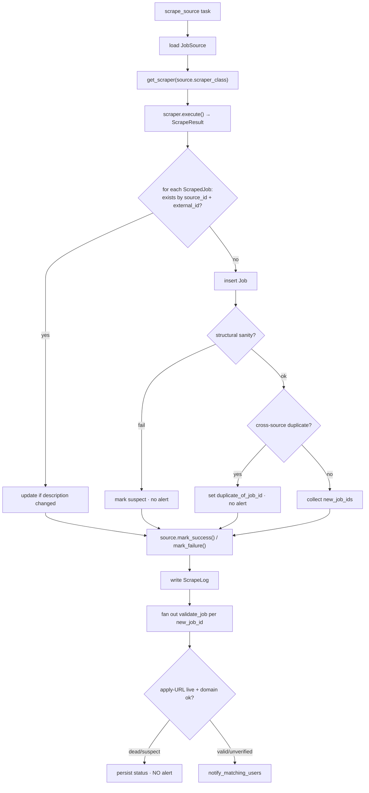

# Job Scraping & Ingestion

How jobs get into the system: Beat wakes every 15 min → due `job_sources` are scraped by their registered scraper class → results are deduped and persisted → new jobs trigger user matching.

## Scraper class hierarchy — [`app/scrapers/base.py`](../app/scrapers/base.py)

```
BaseScraper (ABC)
├── rate limiting (settings.scrape_rate_limit_per_minute)
├── user-agent rotation (settings.scrape_user_agent base)
├── robots.txt check
├── execute() — timing/error wrapper → ScrapeResult
│
├── StaticScraper   # HTML pages: httpx + BeautifulSoup/lxml
└── APIScraper      # JSON endpoints: httpx
```

Data contracts (dataclasses in `base.py`): `ScrapedJob` (one normalized job posting) and `ScrapeResult` (jobs + stats + errors from one run).

## Registry — [`app/scrapers/registry.py`](../app/scrapers/registry.py)

Strategy pattern: each `job_sources` row stores a `scraper_class` string key; `get_scraper(key)` instantiates the class.

| Registry key | Class | File | Type |
|---|---|---|---|
| `greenhouse` | `GreenhouseAPIScraper` | [companies/greenhouse.py](../app/scrapers/companies/greenhouse.py) | APIScraper — works for any Greenhouse-hosted board |
| `lever` | `LeverAPIScraper` | [companies/lever.py](../app/scrapers/companies/lever.py) | APIScraper — any Lever-hosted board |
| `remotive` | `RemotiveAPIScraper` | [companies/remotive.py](../app/scrapers/companies/remotive.py) | APIScraper — Remotive job API |
| `safaricom_careers` | `SafaricomCareersScraper` | [companies/safaricom.py](../app/scrapers/companies/safaricom.py) | Site-specific scraper |

Per-source knobs live in `job_sources.config` (JSONB) — e.g. board tokens/company identifiers consumed by the scraper.

## Ingestion pipeline — [`app/services/scrape_service.py`](../app/services/scrape_service.py)



Trigger paths:
- **Scheduled**: Beat `scrape_all_active_sources` (every 15 min) → `get_due_sources()` (sources whose `scrape_interval_minutes` has elapsed) → one `scrape_source` task each.
- **Manual**: `POST /api/v1/sources/{source_id}/scrape` (dashboard "Scrape now") → same task.

## Validation — [`app/services/validation_service.py`](../app/services/validation_service.py)

A validation stage sits **between ingest and alert fan-out** so dead or misattributed jobs never notify users (`validation_enabled` config kill-switch; when off, `_scrape_source` notifies directly as before). `jobs.validation_status` ∈ `unverified | valid | suspect | dead`:

- **At ingest (synchronous, in `scrape_service`)**: cheap no-network checks. *Structural sanity* (`_structural_issues`: empty/overlong title, too-short description, unparseable apply URL, future `posted_at`) → mark `suspect`, no alert, counted into `ScrapeLog.extra_data` (catches scraper parser drift). *Cross-source dedup* (`find_cross_source_duplicate`: same company + `normalize_title` match from a different source within 30 days) → set `duplicate_of_job_id`, no alert.
- **Post-ingest (`validate_job` task, `default` queue)**: apply-URL **liveness** (HEAD→GET fallback: 404/410 = `dead`, 5xx/timeout = `unverified`) + **domain cross-check** (final host vs `companies.careers_url` domain or the `KNOWN_ATS_DOMAINS` allowlist; mismatch = `suspect`). On `valid`/`unverified` → fan out `notify_matching_users`. **Fail-open**: a flaky/timeout check yields `unverified` and still alerts — validation never silently drops a real job.
- **Nightly (`revalidate_active_jobs`, 02:00 UTC)**: re-checks liveness for the oldest-validated active jobs (`revalidate_after_days`, `revalidate_batch_size`); a listing that reads dead **twice in a row** is deactivated (`is_active=False`, `validation_status=dead`).

`dead` jobs are excluded from `GET /jobs` by default; admins can review with `GET /jobs?validation_status=suspect`.

## Skill extraction at ingest — [`app/core/skills.py`](../app/core/skills.py)

For every new job, `scrape_service` runs `extract_skills(title + description)` against the shared `SKILLS_TAXONOMY` (same taxonomy the CV pipeline uses for `user_skills`) and upserts `job_skills` rows. This powers `GET /jobs/recommended`, skill-aware alerting, and the skill-gap endpoint — all of which had no data before, since nothing populated `job_skills`. Backfill existing jobs with the `backfill_job_skills` Celery task. (Known limitation: substring matching over-hits single-letter skills like "R"/"C"/"Go"; symmetric on both sides.)

## Matching & alerting — [`app/services/notification_service.py`](../app/services/notification_service.py)

`notify_for_new_job(job_id)`:
1. `UserRepository.get_notifiable_users()` — active users with push enabled.
2. `_user_matches_job()` — matches when **preferences match OR CV-skill coverage ≥ 0.5**. Preference match: role keywords vs title, company watchlist (by slug), location incl. remote. Skill match (opt-in via `skill_alerts_enabled`, default on) uses job/user skill sets prefetched in two batched queries (no N+1).
3. Idempotent `UserJobAlert` insert per match.
4. One batched FCM send via [`app/core/push.py`](../app/core/push.py) — marks alerts `is_delivered` on success, clears dead tokens (`UNREGISTERED`), logged no-op without `FCM_CREDENTIALS_PATH` (⚠️ Firebase project setup pending — [known issue #2b](../../docs/known-issues.md)).

## Source health

`job_sources` tracks `health_status`, `last_success_at`, `consecutive_failures`; `mark_success()`/`mark_failure()` are called by the pipeline. Beat's `check_scraper_health` (every 5 min) inspects these — ⚠️ but its admin alerting is also print-only.

## Adding a scraper

1. Create `app/scrapers/companies/<name>.py` subclassing `APIScraper` (JSON) or `StaticScraper` (HTML). Implement the fetch/parse to yield `ScrapedJob`s — look at [greenhouse.py](../app/scrapers/companies/greenhouse.py) as the cleanest template.
2. Register it in [`registry.py`](../app/scrapers/registry.py): add `"<key>": YourScraper` to `SCRAPER_REGISTRY`.
3. Create the source row: `POST /api/v1/sources/` with `scraper_class: "<key>"`, the target URL, `scrape_interval_minutes`, and any `config` the scraper needs (or add it to [`scripts/seed.py`](../scripts/seed.py)).
4. Test manually: `POST /api/v1/sources/{id}/scrape`, then check `GET /sources/{id}/logs` and the `jobs` table.

Etiquette guardrails already built in: per-source rate limiting, timeout (`scrape_timeout_seconds`), robots.txt respect, and an identifying user agent — don't bypass them in new scrapers.

## Stable dedup requirement

`external_id` must be **stable per job per source** (ATS job id, not list position). Dedup is `(source_id, external_id)`; a scraper with unstable ids floods the system with duplicate "new" jobs — and each one fans out user alerts.
